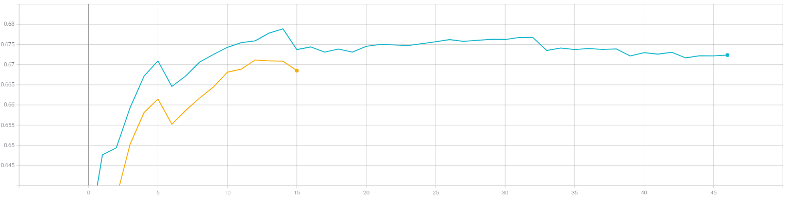

# Лабораторная работа №4.
**Цель лабораторной работы:**
Исследовать влияние различных техник аугментации
данных на процесс обучения нейронной сети на примере решения задачи классификации
Food-101 с использованием техники обучения Transfer Learning.

**Задачи:**
1. С использованием [1], техники обучения Transfer Learning [2] и оптимальной
политики изменения темпа обучения, определенной в ходе выполнения
лабораторной #3, обучить нейронную сеть EfficientNet-B0 (предварительно
обученную на базе изображений imagenet) для решения задачи классификации
изображений Food-101 с использованием следующих техник аугментации данных
[3]:  
* a)Случайное горизонтальное и вертикальное отображение [4]  
* b)Использование случайной части изображения [5]  
* c)Поворот на случайный угол [6]  

2.  Для каждой индивидуальной техники аугментации определить оптимальный набор
параметров.  

3. Обучить нейронную сеть с использованием оптимальных техник аугментации
данных 1a-с совместно.

**Замечания**: В данной лабораторной работе параметр BATCH_SIZE равен 32. Оптимальная политика изменения темпа обучения - cosine decay with restarts с параметрами: initial_learning_rate = 0.001, first_decay_steps = 5000, t_mul = 2.0, m_mul = 0.75.
## 1. С использованием [1], техники обучения Transfer Learning [2] и оптимальной политики изменения темпа обучения, определенной в ходе выполнения лабораторной #3, обучить нейронную сеть EfficientNet-B0 (предварительно обученную на базе изображений imagenet) для решения задачи классификации изображений Food-101 с использованием следующих техник аугментации данных [3]: Случайное горизонтальное и вертикальное отображение [4], Использование случайной части изображения [5], Поворот на случайный угол [6].
* **Графики обучения EfficientNetB0 с использованием аугментации данных RandomFlip**:  
   * График точности epoch_categorical_accuracy:
   
   
 
   * График функции потерь epoch_loss:
   
   
   
 * **Анализ полученных результатов**: Наивысшие значения метрики точности наблюдаются на графике с горизонтальным отображением (67.99%). Также на графике функции потерь горизонтального отображения наблюдаются наименьшие значения (1.194). По сравнению с базовой нейронной сетью, мы выйграли ~0.1% точности. На скорость сходимости данная аугментация данных не повлияла. Оптимальным параметром будет 'horizontal'.
   
 * **Визуализации данных после RandomFlip('horizontal')**:
 

 * **Визуализации данных после RandomFlip('vertical')**:
 

 * **Визуализации данных после RandomFlip('horizontal_and_vertical')**:
   
 
* **Графики обучения EfficientNetB0 с использованием аугментации данных RandomСrop**:  
   * График точности epoch_categorical_accuracy:
   
   
 
   * График функции потерь epoch_loss:
   
   
   
 * **Анализ полученных результатов**: Наивысшие значения метрики точности наблюдаются на графике с параметрами апскейла 300x260 (66.97%). Также на графике функции потерь данного апскейла наблюдаются наименьшие значения (1.239). Однако, по сравнению с базовой нейронной сетью, мы потеряли в точности ~0.85%. На скорость сходимости данная аугментация данных не повлияла. Оптимальным параметром будем считать 300x260.
   
 * **Визуализации данных после RandomCrop(для большей наглядности работы, отобразили для 300x300)**:
 
 
 
 * **Графики обучения EfficientNetB0 с использованием аугментации данных RandomRotation**:  
   Здесь по умолчанию параметр заполнения стоит reflect.
   * График точности epoch_categorical_accuracy:
   
   
 
   * График функции потерь epoch_loss:
   
   
   
 * **Анализ полученных результатов**: Наивысшие значения метрики точности наблюдаются на графике с параметром factor=0.01 (67.62%). Однако на графике функции потерь с параметром factor=0.04 наблюдаются наименьшие значения (1.209). Да и разница в точности между factor=0.01 и 0.04 всего 0.05%. В данном случае я выбрал параметр factor=0.04 как оптимальный, что соответствует границам угла поворота от -14.4 до 14.4 градусов. По сравнению с базовой нейронной сетью, мы потеряли в точности ~0.3%. На скорость сходимости данная аугментация данных не повлияла.
 
* **Графики обучения EfficientNetB0 с использованием аугментации данных RandomRotation(исследуем параметр заполнения fill_mode)**:  
  Здесь параметр factor равен 0.04.  
   * График точности epoch_categorical_accuracy:
   
   
 
   * График функции потерь epoch_loss:
   
   
   
* **Анализ полученных результатов**: Из графиков видно, что наилучшие показатели у параметра заполнения nearest. Мы повысили точность примерно на 0.1%, но по-прежнему показатели хуже, чем у базовой нейронной сети. По итогу, оптимальными параметрами в RandomRotation будем считать factor=0.04 и fill_mode='nearest'.

 * **Визуализации данных после RandomRotation(fill_mode = 'nearest')**:
 

  * **Визуализации данных после RandomRotation(fill_mode = 'wrap')**:
 

  * **Визуализации данных после RandomRotation(fill_mode = 'constant', fill_value=255)**:
 
 
  * **Визуализации данных после RandomRotation(fill_mode = 'reflect')**:
 
 
 
 ## 2. бучить нейронную сеть с использованием оптимальных техник аугментации данных 1a-с совместно.
  * **Графики обучения EfficientNetB0 с использованием оптимальных техник аугментации данных совместно**:
    * График точности epoch_categorical_accuracy:
     
     
 
     * График функции потерь epoch_loss:
     
     
   
* **Анализ полученных результатов**: Из графиков видно, что показатели при совместной аугментации данных хуже, чем у базовой нейронной сети. По скорости схождения изменений нет. Разница в точности примерно 0.8%.
* **Визуализации данных после совместной аугментации данных**
   

## Вывод
В ходе исследований выделили оптимальные параметры для каждого метода аугментации данных. Для RandomFlip - 'horizontal'. Для RandomCrop - апскейл до 300x260, после чего делаем crop размером входа сети. Это сделано для того, чтобы не терялось качество изображения. Для RandomRotation - factor=0.04, fill_mode='nearest'. Однако, одновременное применение этих методов аугментаций данных не дало хороших результатов. Можно сделать вывод, что одновременное применение нескольких оптимальных подходов в решении поставленной задачи не гарантирует улучшение результатов.
